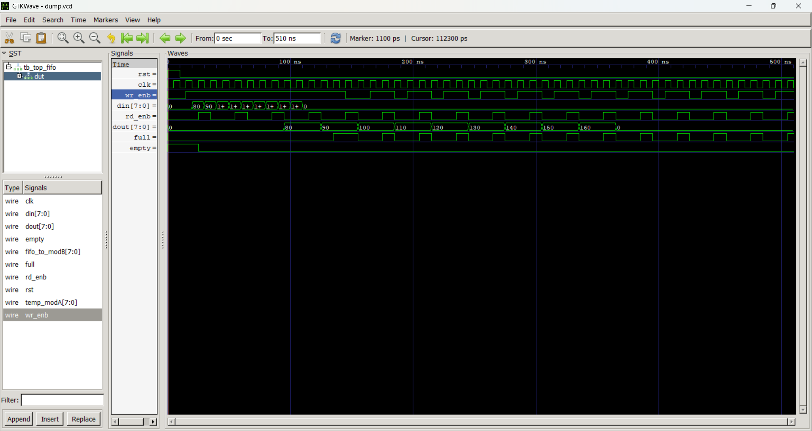

# Synchronous FIFO — RTL Verilog Design

A fully synthesisable **8-depth × 8-bit Synchronous FIFO** implemented in Verilog RTL, featuring a 4-bit pointer-based full/empty flag scheme, a producer module (Module A), and a 3-state FSM consumer module (Module B) — all integrated via a top-level wrapper.

---

## Overview

| Parameter       | Value                          |
|----------------|--------------------------------|
| FIFO Depth      | 8 locations                   |
| Data Width      | 8 bits                        |
| Pointer Width   | 4 bits (MSB used for wrap detection) |
| Clock           | Single clock (synchronous)    |
| Reset           | Active-high, synchronous      |
| Full Flag       | MSB differs, lower 3 bits match |
| Empty Flag      | Write pointer == Read pointer |
| Language        | Verilog RTL                   |
| Tool            | Vivado / ModelSim / iVerilog  |

---

## Architecture

```
         ┌──────────┐     wr_enb, din      ┌──────────┐     rd_enb, dout     ┌──────────┐
 din ───▶│ Module A │ ──────────────────▶  │   FIFO   │ ──────────────────▶  │ Module B │ ──▶ dout
         │ (mod_a)  │ ◀── full             │ (fifo)   │       empty ──────▶  │ (mod_b)  │
         └──────────┘                      └──────────┘                       └──────────┘
                              top_fifo (top-level wrapper)
```

- **Module A (`mod_a`)** — Producer: drives `din` and asserts `wr_enb` when FIFO is not full.
- **FIFO (`fifo`)** — Core: 8×8 synchronous FIFO with pointer-based full/empty logic.
- **Module B (`mod_b`)** — Consumer: 3-state FSM that asserts `rd_enb` and captures data when FIFO is not empty.

---

## Module Descriptions

### `fifo.v` — Core FIFO

#### Ports

| Port     | Dir    | Width | Description                              |
|----------|--------|-------|------------------------------------------|
| `clk`    | Input  | 1     | Clock — all ops on posedge               |
| `rst`    | Input  | 1     | Active-high synchronous reset            |
| `wr_enb` | Input  | 1     | Write enable                             |
| `rd_enb` | Input  | 1     | Read enable                              |
| `din`    | Input  | 8     | Write data                               |
| `dout`   | Output | 8     | Read data                                |
| `full`   | Output | 1     | FIFO full flag                           |
| `empty`  | Output | 1     | FIFO empty flag                          |

#### Full / Empty Logic

```verilog
assign full  = ((wptr[3] != rptr[3]) && (wptr[2:0] == rptr[2:0]));
assign empty = (wptr == rptr);
```

- **4-bit pointers** (`wptr`, `rptr`) wrap past 8 — the MSB (bit 3) acts as an overflow indicator.
- **Full:** lower 3 bits of both pointers match but MSBs differ → one full lap ahead.
- **Empty:** both pointers are identical → nothing written that hasn't been read.

This is the standard 1-extra-bit pointer technique for FIFO flag generation — no extra counter needed.

---

### `moduleA_fifo.v` — Producer (`mod_a`)

Synchronous producer that continuously forwards input data to the FIFO while it has space.

| Behaviour       | Condition          |
|----------------|--------------------|
| Assert `wr_enb`, pass `din` | `!full`       |
| Deassert `wr_enb`            | `full`        |
| Reset            | `dout=0`, `wr_enb=0` |

---

### `moduleB_fifo.v` — Consumer FSM (`mod_b`)

3-state Mealy FSM that reads data from the FIFO when available.

| State        | Next State   | `rd_enb` | Description                          |
|--------------|-------------|----------|--------------------------------------|
| `IDLE`       | `S1`        | 0        | Entry state — transitions immediately |
| `S1`         | `DATA_STATE`| 0        | Intermediate — one cycle wait        |
| `DATA_STATE` | `IDLE` (if `!empty`) | 1 | Assert read, capture data, loop back |
| `DATA_STATE` | `DATA_STATE` (if `empty`) | 0 | Hold until data available |

The FSM correctly separates combinational next-state logic (`always@(*)`) from registered state and data output (`always@(posedge clk)`).

---

### `top_fifo.v` — Top-Level Wrapper

Instantiates and connects all three modules with internal wires:

```
din → mod_a → [wr_enb, modA_to_fifo] → fifo → [rd_enb, fifo_to_modB] → mod_b → dout
                      ↑ full ──────────────┘         ↑ empty ──────────────┘
```

#### Top-Level Ports

| Port   | Dir    | Width | Description          |
|--------|--------|-------|----------------------|
| `clk`  | Input  | 1     | System clock         |
| `rst`  | Input  | 1     | Synchronous reset    |
| `din`  | Input  | 8     | Data into the system |
| `dout` | Output | 8     | Data out of the system |

---

## How to Simulate

### iVerilog + GTKWave (free, open-source)

```bash
# Compile top-level (includes all sub-modules via `include)
iverilog -o fifo_sim tb_top_fifo.v

# Run
vvp fifo_sim

# View waveform
gtkwave dump.vcd
```

### Vivado (Xilinx)

1. Create a new RTL project in Vivado.
2. Add `moduleA_fifo.v`, `moduleB_fifo.v`, `fifo.v`, `top_fifo.v` as design sources.
3. Add `tb_top_fifo.v` as a simulation source.
4. Run **Behavioral Simulation** → observe `full`, `empty`, `wr_enb`, `rd_enb`, `dout`.

---

## Waveform Preview



*Waveform showing reset, write from Module A, FIFO full assertion, FSM-driven reads from Module B, and empty flag behaviour.*

---

## File Structure

```
synchronous-FIFO-rtl-verilog/
├── fifo.v               # Core FIFO RTL — 8×8, pointer-based full/empty flags
├── moduleA_fifo.v       # Producer module — drives wr_enb based on full flag
├── moduleB_fifo.v       # Consumer FSM — 3-state Mealy FSM, drives rd_enb
├── top_fifo.v           # Top-level integration of A, FIFO, and B
├── tb_top_fifo.v        # Testbench for top_fifo
├── synchronous_fifo_wave.png  # GTKWave simulation screenshot
└── README.md            # This file
```

---

## Key RTL Skills Demonstrated

- **Pointer-based FIFO design** using 4-bit wrap-around pointers (MSB-flag technique) — no counter or comparator needed
- **Full/empty flag generation** using combinational `assign` — clean, synthesis-friendly
- **FSM coding** with proper separation of sequential (`always@(posedge clk)`) and combinational (`always@(*)`) blocks
- **Hierarchical RTL integration** — three independent modules connected via a top-level wrapper
- **Non-blocking assignments** (`<=`) throughout all sequential logic
- **Backpressure handling** — Module A deasserts `wr_enb` on full; Module B holds in `DATA_STATE` until FIFO has data

---

## Author

**Badugu Tharaka Ramudu**  
B.Tech ECE — Annamacharya Institute of Technology & Sciences, Hyderabad  
Aspiring VLSI RTL Design Engineer  
📧 tharockbadugu@gmail.com  
🔗 [LinkedIn](https://linkedin.com/in/tharaka-ramudu-badugu)  
🔗 [GitHub](https://github.com/Tharak-badugu)
